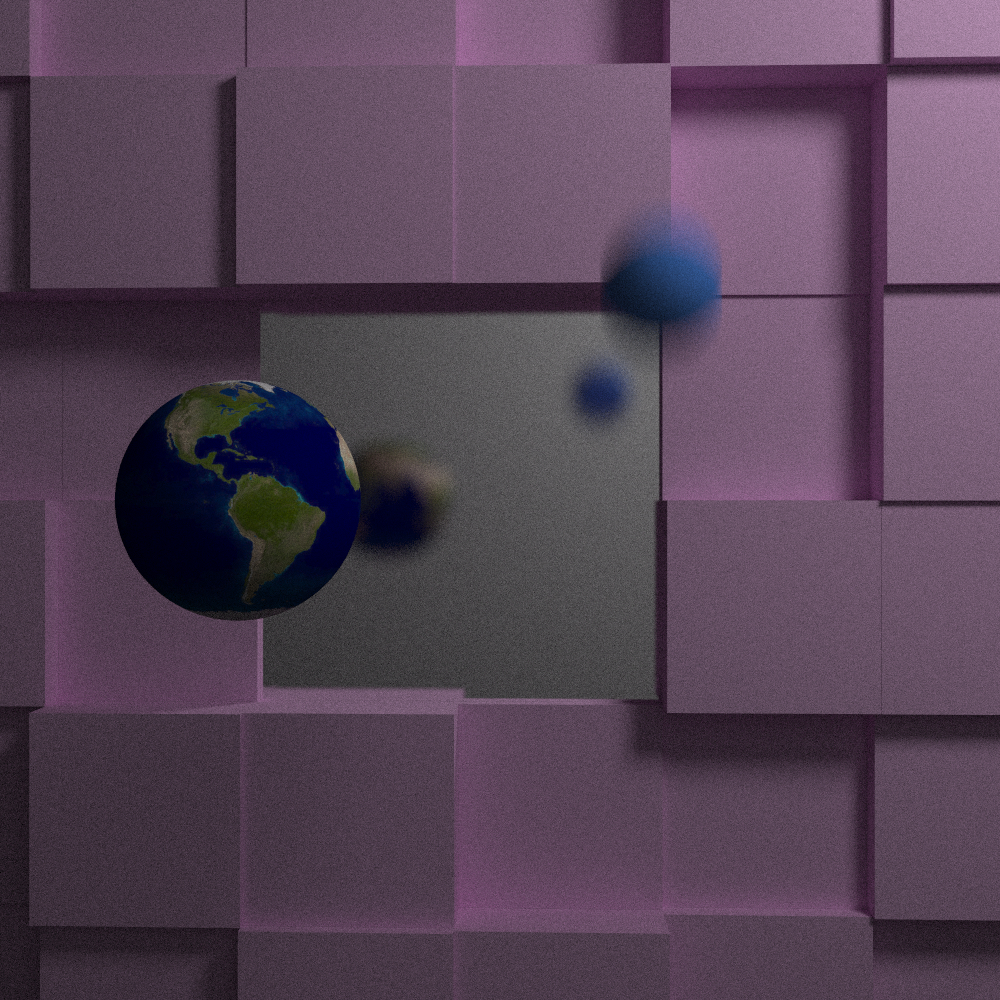
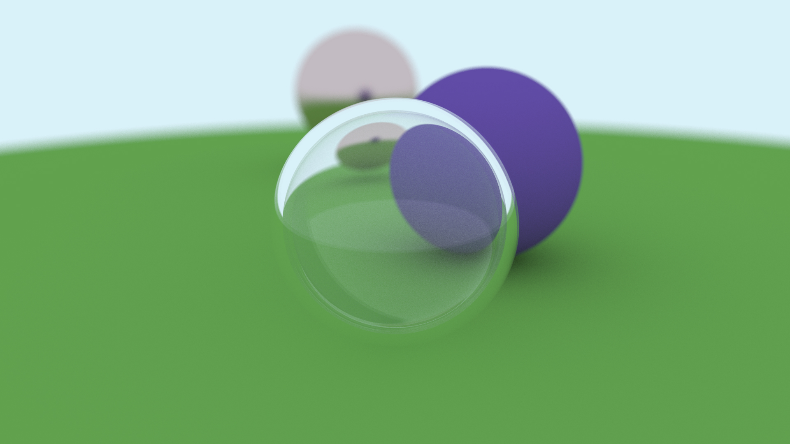
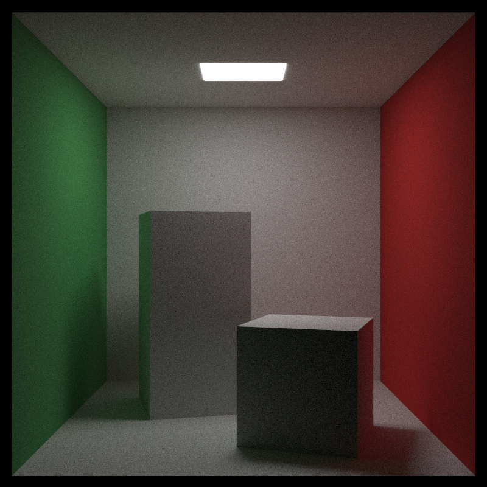

# BasicRayTracer



## Summary
This software ray tracer was built to help me understand the ray tracing algorithm and associated techniques around physically based rendering. I built it by following along with books 1 and 2 of the Ray Tracing in One Weekend series:

1. [_Ray Tracing in One Weekend_](https://raytracing.github.io/books/RayTracingInOneWeekend.html)
2. [_Ray Tracing: The Next Week_](https://raytracing.github.io/books/RayTracingTheNextWeek.html)

## Features:
- Direct and indirect lighting (global illumination)
- Sphere and axis-aligned rectangle primitives
- Physically based camera model with adjustable vfov, focus distance, defocus blur (depth of field), motion blur
- Bounding Volume Heirarchy (BVH) support for ray-primitive intersection acceleration
- Various materials
  - Lambertian (matte)
  - Metal (can be tinted and made rough/smooth)
  - Dielectrics
  - Diffuse (area) lights
- Image texture mapping
- Primitive instancing with translation and rotation support
- Adjustable samples per pixel for anti-aliasing
- Image output to .ppm, .jpeg, .bmp

## Gallery

### Sample Scene 1

> 1920x1080, 500 samples per pixel, 50 max ray bounces

### Sample Scene 2

> 800x800, 2500 samples per pixel, 50 max ray bounces

### Sample Scene 3

> 1000x1000, 3000 samples per pixel, 50 max ray bounces

## How to use

1. Clone this repository.
2. In `main.cpp`, at the top of the `main()` function, select **ONE** scene by commenting/uncommenting the following:
```
// For example, this selects scene 1:

scene.Construct1();
// scene.Construct2();
// scene.Construct3();
```


3. Below the scene selection, specify the image width, samples per pixel, max ray bounces, and output format:

```
const double IMAGE_ASPECT_RATIO = scene.m_Camera.m_ImageAspectRatio;
const int32_t IMAGE_WIDTH = 600;
const int32_t IMAGE_HEIGHT = (int32_t)(IMAGE_WIDTH / IMAGE_ASPECT_RATIO); // Image height is determined automatically based on the scene's aspect ratio
const int32_t SAMPLES_PER_PIXEL = 200;
const int32_t MAX_RAY_BOUNCES = 50;
const OutputFormat OUTPUT_FORMAT = OutputFormat::JPEG; // Supports PPM, BMP, and JPEG
```

4. Run the program in release configuration. When the program is finished, the output file will be named with a timestamp and located in the `RayTracer` directory.

## Next steps

Some areas of ray tracing / physically based rendering I'd like to explore in the future:
- Parallelism (each pixel is independent)
- Triangle primitives to render polygon meshes
- Automatic acceleration structure (BVH) construction (as opposed to manual definition)
- Volume rendering and subsurface scattering
- Monte Carlo Integration 
